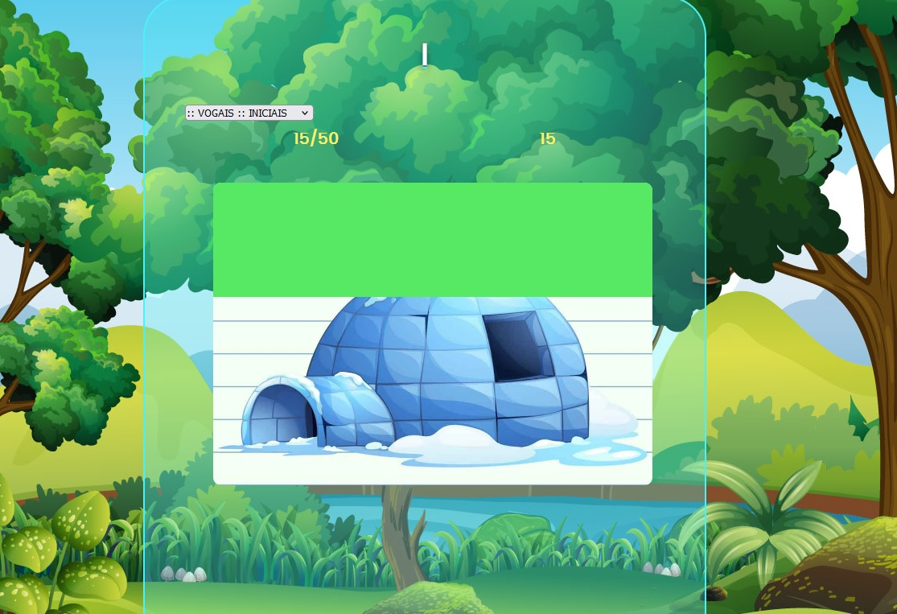
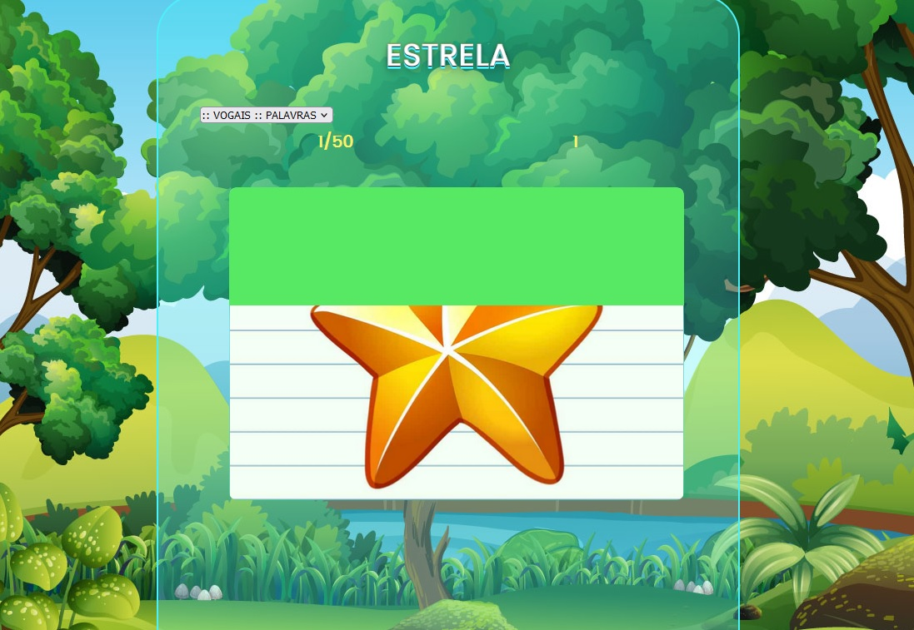

# QUIZ-VOGAIS
Trechos de códigos de um questionário das famílias silábicas com imagens, contendo interação de perguntas animadas para que o jogador reconheça as suas respectivas iniciais e as formações das palavras. Desenvolvido com 5,0% de variáveis CSS, 94,5% de práticas JavaScript(puro) e 0,5% de elementos HTML.

https://mqjogos.github.io/QUIZ/app.html

<h1>VOGAIS INICIAIS</h1>

<h1>VOGAIS PALAVRAS</h1>

  
# CÓDIGO FONTE:
 - 
#
 - 
#
 - 
#

# Color Palette:
 - https://mycolor.space

# Editor de Imagens Online:
 - https://www.resizepixel.com/pt/edit

# Imagens:
- https://www.freepik.com/
- https://www.storyset.com/
- https://www.undraw.com/
- https://www.pixabay.com/
- https://www.unsplash.com/
- https://www.flaticon.com/
- https://www.pngegg.com/
